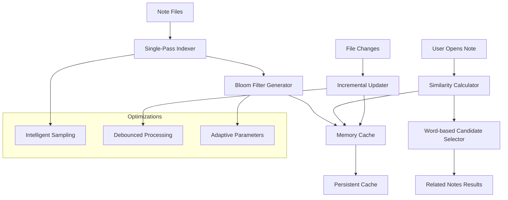

# Related Notes Plugin for Obsidian

[](https://github.com/mrboxtobox/obsidian-related-notes/actions)

Find related notes in your vault using bloom filter similarity analysis.


## Features

- Bloom filter-based similarity detection
- One-click linking between related notes
- Local processing (no data sent externally)
- Multi-language support including CJK scripts
- Automatic optimization for large vaults

## Installation

1. Open Obsidian Settings
2. Navigate to Community plugins and disable Restricted mode
3. Select **Browse** and search for "Related Notes"
4. Select **Install**
5. Enable the plugin in the Community plugins tab

## Usage

### Viewing related notes

1. Select the lightning (⚡️) icon in the ribbon to open the Related notes sidebar
2. The plugin will automatically show related notes for your active note
3. Select the **Link** button to create a link to a related note
4. You can also use the command palette and search for "Toggle related notes"

### Force re-indexing

The plugin automatically indexes your notes and updates the index when notes are modified. However, if you want to force a complete re-indexing of all notes:

1. Open Obsidian Settings
2. Navigate to the Related notes plugin settings
3. In the "Index management" section, select the **Rebuild index** button
4. Wait for the re-indexing to complete (progress will be shown in the status bar)

Force re-indexing is useful when:
- You've made significant changes to many notes
- You suspect the index might be out of date
- You want to ensure the most accurate related notes suggestions

## Configuration

Settings:

### Basic settings
- **Maximum suggestions**: Control how many related notes are displayed (1-20)
- **Rebuild index**: Button to trigger a complete re-indexing of all notes

### Debug mode
Enable to view detailed statistics about the plugin's operation in the developer console.

### How it works

The plugin uses bloom filters with n-gram analysis:

- Single-pass indexing of all notes
- Probabilistic similarity detection using 3-grams
- Text tokenization with CJK script support
- Automatic parameter optimization based on vault size

### Performance

- Memory usage: ~1KB per 1000 notes
- Single-pass indexing with periodic cache saves
- Automatic sampling for vaults over 10,000 notes
- Incremental updates when files are modified

## Development

### Prerequisites

- Node.js 18+
- npm
- Basic knowledge of TypeScript and Obsidian Plugin Development

### Setup

1. Clone this repository
```bash
git clone https://github.com/mrboxtobox/obsidian-related-notes.git
cd obsidian-related-notes
```

2. Install dependencies
```bash
npm install
```

3. Build the plugin
```bash
npm run build
```

### Development workflow

- `npm run dev` - Starts development build with hot-reload
- `npm run dev:test` - Starts development build with hot-reload and copies files to `test-vault` (you will need to create this)
- `npm run dev:custom` - Starts development build with custom target directories (set TARGET_DIRS env var)
- `npm run build` - Creates a production build
- `npm run build:test` - Creates a production build and copies files to test-vault
- `npm run build:custom` - Creates a production build with custom target directories (set TARGET_DIRS env var)
- `npm run version` - Updates version numbers in manifest.json and versions.json

### Project structure

- `src/main.ts` - Main plugin file with core functionality and event handling
- `src/core.ts` - Core similarity algorithms and interfaces
- `src/bloom.ts` - Bloom filter implementation for efficient similarity calculation
- `src/multi-bloom.ts` - Multi-resolution bloom filter with adaptive parameters
- `src/settings.ts` - Settings tab implementation
- `src/ui.ts` - User interface components for related notes view
- `src/styles.css` - Custom CSS styles for the plugin
- `src/manifest.json` - Plugin manifest file
- `package.json` - Project configuration and dependencies
- `esbuild.config.mjs` - Build configuration for esbuild that handles copying files

### Key dependencies

- `obsidian` - Obsidian API types and utilities

## Release Process

The following scripts are available to streamline the release process:

1. Validate your plugin against Obsidian's requirements:
```bash
npm run validate
```

1. Create a new release (patch, minor, or major version):
```bash
npm run release:patch  # For bug fixes
npm run release:minor  # For new features
npm run release:major  # For breaking changes
```

The release script will:
- Check for uncommitted changes
- Validate the plugin against Obsidian's requirements
- Bump the version in package.json and manifest.json
- Create a git tag
- Push to GitHub
- Trigger the GitHub Actions workflow to create a release

3. GitHub Actions will build the plugin and create a draft release with the required files:
- `main.js`
- `manifest.json`
- `styles.css`

4. Review the draft release on GitHub and publish it when ready.

## License

This project is licensed under the MIT License. See the LICENSE file for details.

## Contributing

Contributions are welcome! Please feel free to submit a Pull Request.

## 🚨 Troubleshooting

### Plugin freezes or becomes unresponsive

If the plugin freezes during indexing or becomes unresponsive, especially in large vaults (5,000+ notes):

**Quick Recovery Steps:**

1. **Force-quit Obsidian** completely (not just close the window)
2. **Remove the plugin cache** by deleting the cache directory:
   ```bash
   # Navigate to your vault's .obsidian folder and run:
   rm -rf .obsidian/plugins/related-notes
   ```
   Or manually delete the `.obsidian/plugins/related-notes` folder
3. **Restart Obsidian**
4. **Reinstall the plugin** from Community Plugins
5. The plugin will rebuild its index automatically with optimizations for large vaults

**Alternative Recovery (Preserve Settings):**

If you want to keep your plugin settings:
1. Force-quit Obsidian
2. Delete only the cache files:
   ```bash
   # In your vault's .obsidian/plugins/related-notes/ folder:
   rm -f .bloom-filter-cache.json
   rm -f bloom-filter-cache.json  
   rm -f similarity-cache.json
   ```
3. Restart Obsidian

### Index corruption issues

If you see errors like "Array length mismatch" or "Cache format incompatibility":

- The plugin automatically detects and fixes these issues
- If problems persist, follow the cache deletion steps above
- The plugin will rebuild with the correct format

### Performance in large vaults

For vaults with 10,000+ notes:

- The plugin uses single-pass indexing with intelligent optimizations
- Initial indexing completes in one efficient pass
- Automatic sampling keeps performance excellent even in massive vaults
- Use the "Clear Cache" and "Rebuild Index" buttons in settings if needed
- Monitor progress in the status bar with real-time file information

## Support

If you encounter any issues or have questions:

1. Check the troubleshooting section above first
2. Check the [GitHub Issues](https://github.com/mrboxtobox/obsidian-related-notes/issues)
3. Create a new issue if your problem hasn't been reported
4. Provide as much information as possible, including:
   - Steps to reproduce the issue
   - Your Obsidian version
   - Your plugin version
   - Vault size (approximate number of notes)
   - Any relevant error messages from the Developer Console (Ctrl+Shift+I)

## Architecture Overview

Architecture overview:



### Data flow

```
┌─────────────────┐    ┌──────────────────┐    ┌─────────────────┐
│   Markdown      │    │   Tokenization   │    │  Bloom Filter   │
│     Files       │───▶│   & Analysis     │───▶│   Generation    │
│                 │    │                  │    │                 │
└─────────────────┘    └──────────────────┘    └─────────────────┘
                                ▲                        │
                                │                        ▼
┌─────────────────┐    ┌──────────────────┐    ┌─────────────────┐
│   File Events   │    │   Incremental    │    │   Cache Layer   │
│   (Create/Edit) │───▶│   Processing     │◀───│   (Memory+Disk) │
│                 │    │                  │    │                 │
└─────────────────┘    └──────────────────┘    └─────────────────┘
                                                         │
                                                         ▼
                              ┌─────────────────────────────────────┐
                              │        Similarity Engine           │
                              │                                     │
                              │  • Word-based Candidate Selection  │
                              │  • Bloom Filter Comparison         │
                              │  • Jaccard Similarity Scoring      │
                              │  • Result Ranking & Filtering      │
                              └─────────────────────────────────────┘
```

---

## Support the Project

If this plugin helps you discover meaningful connections in your notes, consider supporting its development:

[](https://buymeacoffee.com/mrboxtobox)

Your support helps maintain and improve this plugin. Thank you! ☕️
